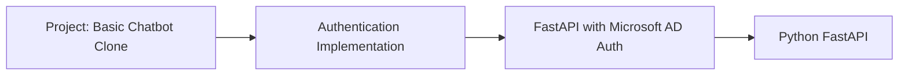

# Project: Basic Chatbot Clone

## Project Description
This project is a basic chatbot clone. Its primary focus is demonstrating authentication implementation using FastAPI within a monolithic architecture.

## Methodology
The developer implemented authentication for a basic chatbot clone using FastAPI and Microsoft Active Directory. The project is structured as a monolithic application.

## Tech Stack
Python (FastAPI), Microsoft AD

## Other Notes
Project is a basic chatbot clone. Focus is on demonstrating authentication implementation using FastAPI within a monolithic architecture. Authentication is implemented using Microsoft AD. Tech stack used is python(fast api).

## Mermaid Chart (Architecture)

## Urls
No URL was used in this project.

## Learning
fast api, auth and basic sessions management

## Authentication Flow

## Setup Instructions
